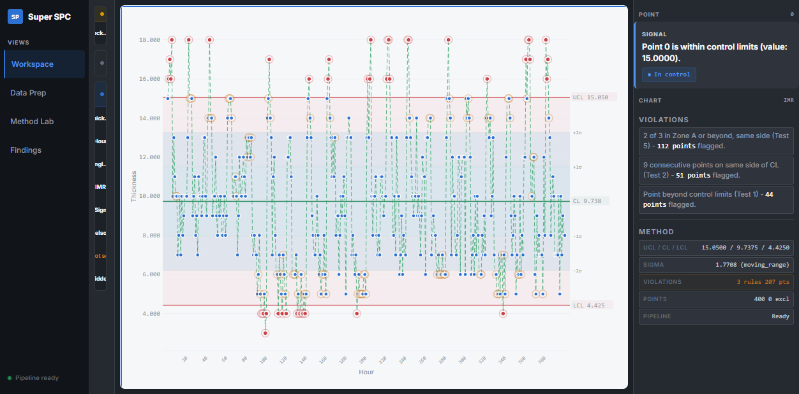
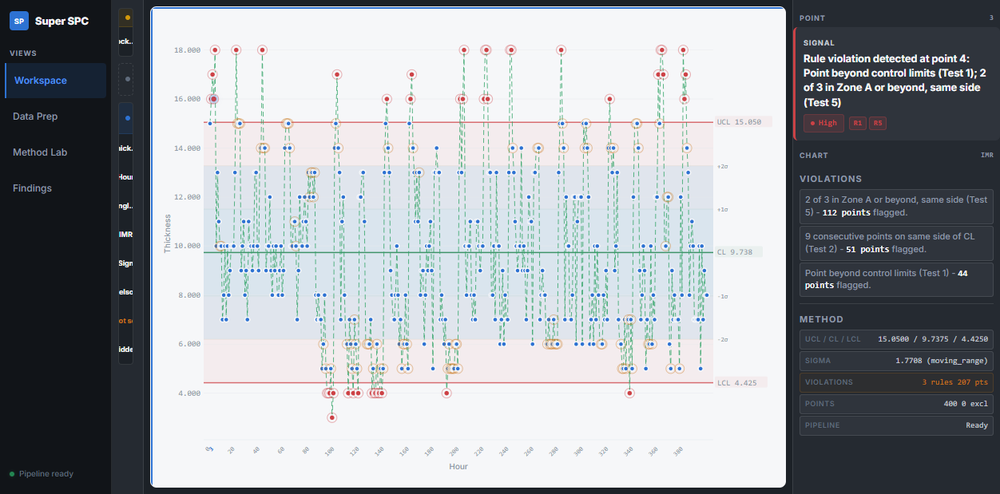
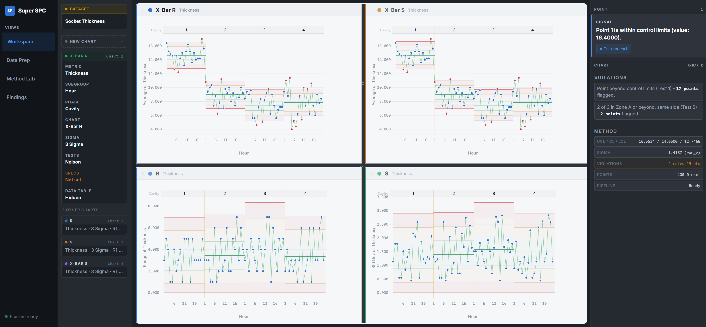
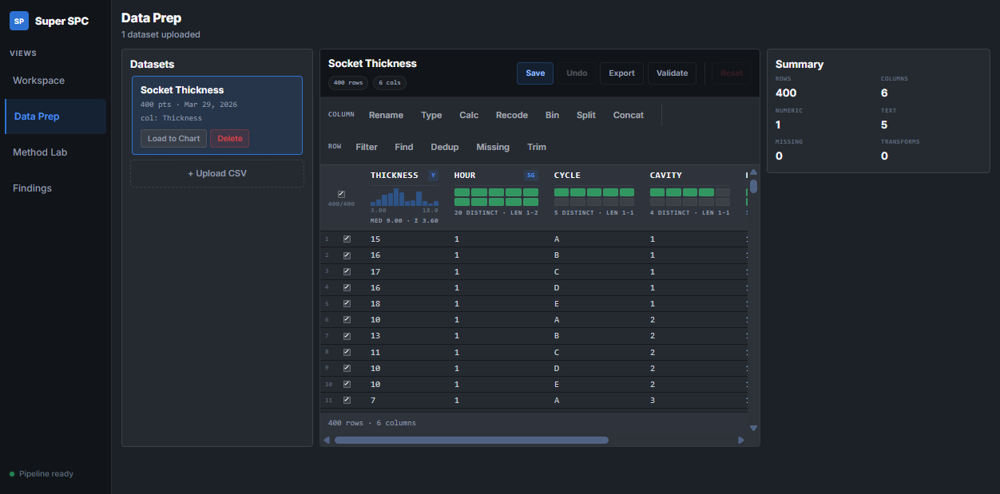
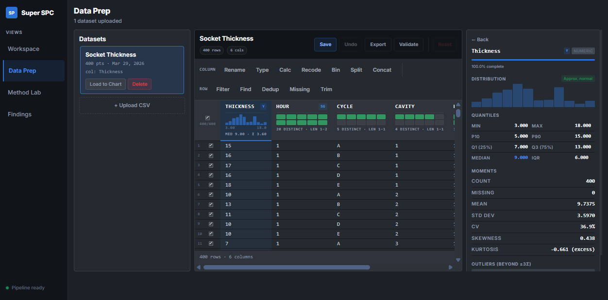
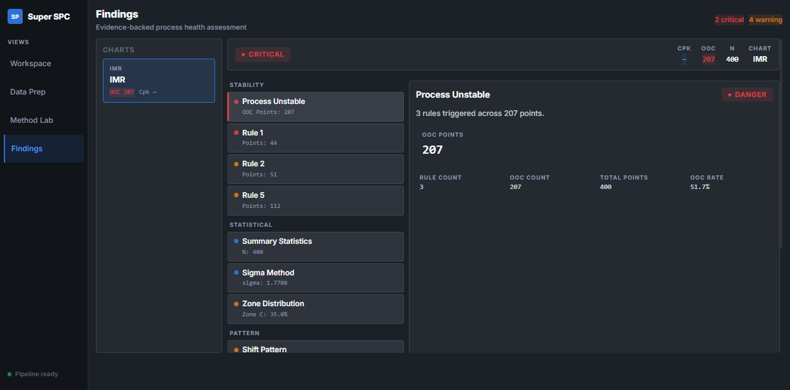

<div align="center">

# Super SPC

### Open-source SPC platform for process engineers, reliability engineer or anyone who is interested in process control and tired of paying tools like JMP/Minitab in full price for a single spc platform

**24 chart types. 8 Nelson rules. Zero dashboard fluff. more functionalities keep coming**

Built for process engineers who are tired of clicking through wizards.

[Getting Started](#getting-started) &bull; [Features](#features) &bull; [Chart Types](#chart-types) &bull; [Why Super SPC](#why-super-spc) &bull; [Architecture](#architecture)

---



</div>

## What is Super SPC?

Super SPC is an totally open-source statistical process control platform purpose-built for process control and quality engineering, anyone interested in developing this app is welcomed

It's what you'd get if **JMP's control chart builder** is too old for you, or some other tools are more like toys and underdeveloped

```
No wizards. No "AI insights." No 47-click workflows.
Better UI, More Functionalities and open to co-develop
```

## Getting Started

### Prerequisites

- **Node.js** 18+
- **Python** 3.10+
- A CSV file with process data

### Quick Start

```bash
# Clone the repository
git clone https://github.com/dongyibing4real/super-spc.git
cd super-spc

# Install frontend dependencies
npm install

# Install backend dependencies
cd api && pip install -r requirements.txt && cd ..

# Start the backend
cd api && uvicorn main:app --reload --port 8000 &

# Start the frontend
npm run dev --port 4173
```

Open **http://localhost:4173** and drop a CSV.

That's it. No account creation. No cloud sync. No telemetry.

## Features

### Control Charts That Actually Work

> Zone shading, rule violation rings, capability indices, phase boundaries — all visible by default.



<table>
<tr>
<td width="50%">

**24 chart types** covering every SPC scenario:
- Shewhart variables & attributes
- CUSUM (tabular + V-mask)
- EWMA with residuals & forecast
- Hotelling T² & MEWMA
- Short-run, rare event, Laney P'/U'
- Run charts with runs test

Every chart includes **zone shading**, **rule violation markers**, and **capability indices** — visible by default, not buried in a submenu.

</td>
<td width="50%">

**Multi-chart workspace** with drag-to-arrange grid:
- Independent charts, no forced pairing
- Per-chart accent colors (8-color cycle)
- Adaptive layout — padding and fonts scale with pane size
- Plot area guaranteed ≥60% of vertical space
- Axis pan/scale by dragging directly on the axis (JMP-style)

</td>
</tr>
</table>

### Recipe Rail — Configuration Without the Modal Hell

Every chart parameter is a **clickable chip** in the left rail. Metric, subgroup, phase, chart type, sigma method, Nelson tests, spec limits — all visible, all inline-editable. No wizards. No "next step." No modals.

```
┌──────────┬────────────────────┬───────────┐
│ Recipe   │                    │ Evidence  │
│ Rail     │   Chart Arena      │ Rail      │
│          │                    │           │
│ [Metric] │   ┌────┬────┐      │ Signal    │
│ [Subgrp] │   │ IMR│XBar│      │ Violations│
│ [Phase ] │   │    │  R │      │ Evidence  │
│ [Chart ] │   └────┴────┘      │           │
│ [Sigma ] │                    │           │
│ [Tests ] │                    │           │
│ [Specs ] │                    │           │
└──────────┴────────────────────┴───────────┘
```

### Multi-Chart Workspace



### Data Prep — 14 Transforms, Zero Round-Trips

Client-side data engine powered by [Arquero](https://uwdata.github.io/arquero/). Every transform is immutable and undoable.

| Phase 1 (Row Ops) | Phase 2 (Column Ops) | Phase 3 (Validation) |
|---|---|---|
| Filter (11 operators) | Rename | Range validation |
| Find & Replace (regex) | Change type | Allowed values |
| Remove duplicates | Calculated columns | Regex patterns |
| Missing values (7 strategies) | Recode values | Column profiling |
| Trim & clean | Bin / Split / Concat | Normality assessment |
| Sort (multi-column) | | Outlier detection |
| Column reorder & hide | | |

Column headers show **inline histograms**, **completeness bars**, and **summary stats**. Click any column for a full statistical profile — quantiles, moments, outlier counts, normality assessment.





### Forecast & Prediction

6 algorithms, one click. Confidence cone renders inline with **ghost zone coloring** — blue within limits, red beyond.

- Seasonal-harmonic
- Kalman state-space
- EWMA projection
- Linear / Quadratic trend
- Drift score with OOC estimate

### Auto-Generated Findings



After every analysis, the findings engine scans for **stability**, **capability**, **statistical**, and **pattern** issues. Each finding has a severity, a metric hero, and a context grid. No AI hallucinations — just deterministic rules applied to your data.

### Keyboard-First

| Key | Action |
|-----|--------|
| `←` `→` | Navigate points |
| `n` / `p` | Jump to next/previous violation |
| `?` | Show all shortcuts |
| `R` `T` `C` `F` `D` `Z` | Data prep operations |

## Chart Types

### Shewhart Variables (10)
`XBar-R` &bull; `XBar-S` &bull; `IMR` &bull; `R` &bull; `S` &bull; `MR` &bull; `Run Chart` &bull; `Levey-Jennings` &bull; `Presummarize` &bull; `Three-Way`

### Shewhart Attributes (6)
`P` &bull; `NP` &bull; `C` &bull; `U` &bull; `Laney P'` &bull; `Laney U'`

### Short Run (4)
`Difference` &bull; `Z` &bull; `MR` &bull; `XBar variants`

### Rare Event (2)
`G chart` &bull; `T chart`

### Advanced Platforms (5)
`CUSUM Tabular` &bull; `CUSUM V-Mask` &bull; `EWMA` &bull; `Hotelling T²` &bull; `MEWMA`

**Total: 27 chart types** — all with zone shading, 8 Nelson rules, 6 Westgard rules, and per-phase limit support.

## Why Super SPC

### vs. JMP

| | JMP | Super SPC |
|---|---|---|
| Price | ~$3,000/year per seat | Free |
| Chart config | 4+ dialog boxes deep | Inline chips, zero modals |
| Dark mode | No | Default |
| Keyboard navigation | Limited | Full (←→ n/p shortcuts) |
| Forecast overlay | No | 6 algorithms, inline |
| Auto-generated findings | No | Deterministic engine |
| Data transforms | Separate window | Inline, undoable, 14 ops |
| Web-based | No (desktop only) | Yes |

### vs. Minitab

| | Minitab/JMP | Super SPC |
|---|---|---|
| Price | $$$$ | Free |
| Multi-chart workspace | Separate windows | Drag-to-arrange grid |
| Rule violation markers | Text output | Colored rings on points |
| Column profiling | Separate analysis | Inline in table headers |
| Open source/co-develop | No | Yes |
| Self-hostable | No | Yes |

### vs. InfinityQS / NWA

| | Enterprise SPC | Super SPC |
|---|---|---|
| Deployment | 6-month IT project | `npm run dev` |
| Configuration | Admin portal | Recipe chips |
| Per-seat licensing | $$$$ | Free |
| Customization | Vendor ticket | Fork and edit |
| Data ownership | Their cloud | Your machine |

## Architecture

```
┌─────────────────────────────────────────┐
│              Frontend (Vite)            │
│  Vanilla JS + D3.js + morphdom          │
│  Arquero (client-side data transforms)  │
│  PapaParse (CSV parsing)                │
└──────────────────┬──────────────────────┘
                   │ REST API
┌──────────────────▼──────────────────────┐
│            Backend (FastAPI)            │
│  SQLite (WAL mode)                      │
│  async SQLAlchemy                       │
└──────────────────┬──────────────────────┘
                   │ Python imports
┌──────────────────▼──────────────────────┐
│          algo/ (Pure Python)            │
│  24 chart types · 8 Nelson rules        │
│  6 Westgard rules · 7 sigma methods     │
│  CUSUM ARL profiler · Capability        │
│  numpy + scipy + attrs                  │
│  1,076 tests (pytest + hypothesis)      │
└─────────────────────────────────────────┘
```


## Design System

Dark-first, command-center aesthetic derived from Palantir Blueprint tokens.

- **Typography:** Inter (UI) + IBM Plex Mono (data values)
- **Color:** 6 background tiers, 8-accent cycle, SPC-specific chart colors
- **Density:** 4px base unit, 8-12px panel padding, 3-8px border radius ceiling
- **Motion:** Invisible-functional (60-250ms, Material easing)
- **Chart island:** Light surface (`#F6F7F9`) embedded in dark workspace — not pure white

## Project Structure

```
super-spc/
├── src/                    # Frontend source
│   ├── app.js              # App orchestrator + event delegation
│   ├── styles.css          # Design tokens + all styles
│   ├── core/               # State management + findings engine
│   ├── components/         # Sidebar, recipe rail, chart arena
│   │   └── chart/          # D3 chart modules (13 files)
│   ├── views/              # Route views (workspace, dataprep, methodlab, findings)
│   ├── data/               # CSV engine, API client, transforms
│   └── prediction/         # 6 forecast algorithms
├── api/                    # FastAPI backend
│   ├── main.py             # App setup, CORS, lifespan
│   ├── models.py           # SQLAlchemy models
│   ├── routes/             # Dataset CRUD + analysis endpoints
│   └── services/           # Analysis orchestration
├── algo/                   # Pure Python SPC algorithms
│   ├── variable_charts/    # IMR, XBar-R, XBar-S, etc.
│   ├── attribute_charts/   # P, NP, C, U, Laney
│   ├── cusum/              # CUSUM tabular + V-mask
│   ├── ewma/               # EWMA with residuals
│   ├── hotelling_t2/       # Multivariate T²
│   ├── mewma/              # Multivariate EWMA
│   ├── rules/              # Nelson + Westgard
│   ├── capability/         # Cp/Cpk/Pp/Ppk
│   └── constants/          # SPC constants tables (n=2..50)
└── .claude/                # Design system + specs + plans
```

## Contributing

Contributions are welcome. Please read the design system docs in `.claude/design/` before making UI changes.

```bash
# Run the algo test suite
cd algo && pytest -x --tb=short

# Run with property-based tests
cd algo && pytest --hypothesis-show-statistics
```

## License

MIT

---

<div align="center">

**Built for engineers who measure in sigmas, not story points.**

[Report a Bug](https://github.com/dongyibing4real/super-spc/issues) &bull; [Request a Feature](https://github.com/dongyibing4real/super-spc/issues)

</div>
