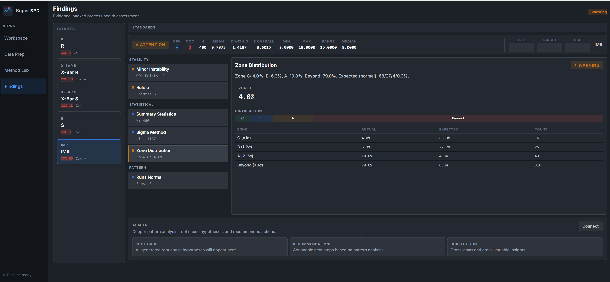

<div align="center">

# Super SPC

### A fully open-source modern statistical process control platform

[Getting Started](#getting-started) &bull; [Features](#features) &bull; [Chart Types](#chart-types) &bull; [Why Build This Project](#why-build-this-project) &bull; [Architecture](#architecture)

---


</div>

## Why Build This Project

Many established products, such as **JMP** and **Minitab**, are still authoritative tools in the **Six Sigma** and quality engineering space, but they also come with familiar constraints:

- they are difficult to customize for new workflows;
- product iteration is slow and the interaction model is heavily wizard-driven;
- the ecosystem is closed, with core algorithm code unavailable;
- their adaptability to newer AI/ML workflows is limited.

More importantly, they are expensive. If your daily work is focused mainly on SPC, you often end up paying for a large surface area of functionality you may never use.

And even then, the SPC experience itself is not especially fascinating. A large share of the classical methods and workflows can already be reproduced with Python, but the product experience around them is still poor.

Thanks to AI-assisted coding, it is now realistic for a small team, or even a single engineer, to build a serious product in this space. **Super SPC** was created from that shift. It draws inspiration from classic data visualization and quality engineering tools, but rebuilds the experience around modern interaction patterns and a modern application architecture.

There is still plenty to improve. Many areas are unfinished, and there is still room to integrate more AI/ML capability from PHM and APC workflows. But the iteration speed is now much higher than before, and contributions, suggestions, and domain feedback from process engineers, reliability engineers, and anyone interested in this project are very welcome.

## Features

### Chart Is the Hero

- Maximize chart interactivity: `marquee selection`, axis `pan/zoom`, and selectable phase regions
- A rich evidence rail on the right side for selected point details and method context
- A configurable forecast area for projecting series behavior in place (in progress)


### Multi-Chart Workspace

- Arrange multiple charts side by side
- Drag to reorder
- Adaptive scaling


<table>
<tr>
<td width="50%">

**24 chart types** covering common SPC scenarios:
- Shewhart variables and attributes
- CUSUM (`tabular` + `V-mask`)
- EWMA with residuals and forecast
- Hotelling `T²` and `MEWMA`
- `short-run`, `rare event`, `Laney P'` / `Laney U'`
- `run chart` with `runs test`

</td>
<td width="50%">

**Multi-chart workspace** supports drag-to-arrange layout:
- charts stay independent, with no forced pairing
- each chart gets its own accent color in an 8-color cycle
- adaptive layout adjusts padding and type scale based on pane size
- plot area remains usable under tighter layouts
- axes can be dragged directly for `pan` / `scale`, similar to JMP

</td>
</tr>
</table>

### Data Prep With Fewer Round-Trips

The client-side data engine is built on [Arquero](https://uwdata.github.io/arquero/).

| Phase 1 (Row Ops) | Phase 2 (Column Ops) | Phase 3 (Validation) |
|---|---|---|
| Filter (11 operators) | Rename | Range validation |
| Find & Replace (regex) | Change type | Allowed values |
| Remove duplicates | Calculated columns | Regex patterns |
| Missing values (7 strategies) | Recode values | Column profiling |
| Trim & clean | Bin / Split / Concat | Normality assessment |
| Sort (multi-column) |  | Outlier detection |
| Column reorder & hide |  |  |

Column headers surface **inline histogram**, **completeness bar**, and **summary stats**. Click any column to inspect a fuller statistical profile, including `quantiles`, `moments`, `outlier counts`, and `normality assessment`.


### Findings

Drill into each chart's control-state information and expose structured insights.



### Method Lab

Compare detection behavior across different chart methods.


### Keyboard-First

| Key | Action |
|---|---|
| `←` `→` | Navigate between points |
| `n` / `p` | Jump to next / previous violation |
| `?` | Show shortcuts |
| `R` `T` `C` `F` `D` `Z` | Data prep operations |

## Chart Types

### Shewhart Variables (10)
`XBar-R` &bull; `XBar-S` &bull; `IMR` &bull; `R` &bull; `S` &bull; `MR` &bull; `Run Chart` &bull; `Levey-Jennings` &bull; `Presummarize` &bull; `Three-Way`

### Shewhart Attributes (6)
`P` &bull; `NP` &bull; `C` &bull; `U` &bull; `Laney P'` &bull; `Laney U'`

### Short Run (4)
`Difference` &bull; `Z` &bull; `MR` &bull; `XBar variants`

### Rare Event (2)
`G chart` &bull; `T chart`

### Advanced Platforms (5)
`CUSUM Tabular` &bull; `CUSUM V-Mask` &bull; `EWMA` &bull; `Hotelling T²` &bull; `MEWMA`

**27 chart types in total**, all with `zone shading`, `Nelson rules`, `Westgard rules`, and `per-phase` limit support.

## Architecture

```text
Frontend (Vite)
- Vanilla JS + D3.js + morphdom
- Arquero (client-side data transforms)
- PapaParse (CSV parsing)

REST API

Backend (FastAPI)
- SQLite (WAL mode)
- async SQLAlchemy

Python imports

algo/ (Pure Python)
- 24 chart types + 8 Nelson rules
- 6 Westgard rules + 7 sigma methods
- CUSUM ARL profiler + capability
- numpy + scipy + attrs
- pytest + hypothesis
```

## Getting Started

### Prerequisites

- **Node.js** 18+
- **Python** 3.10+
- A CSV file with process data

### Quick Start

```bash
# Clone repository
git clone https://github.com/dongyibing4real/super-spc.git
cd super-spc

# Install frontend dependencies
npm install

# Install backend dependencies
cd api
pip install -r requirements.txt
cd ..

# Start backend
cd api
uvicorn main:app --reload --port 8000

# Open a second terminal and start frontend
npm run dev -- --port 4173
```

Open **http://localhost:4173** to launch the app.

The project uses a `Vite + FastAPI` architecture that is straightforward for a small or medium-sized team to extend.

## Contributing

Contributions are welcome. Before making UI changes, please read the design system docs under `.claude/design/`.

```bash
# Run the algo test suite
cd algo
pytest -x --tb=short

# Run property-based tests
pytest --hypothesis-show-statistics
```

## License

This project is licensed under **AGPL-3.0**. See [LICENSE](LICENSE).

---

<div align="center">

[Report a Bug](https://github.com/dongyibing4real/super-spc/issues)

</div>
