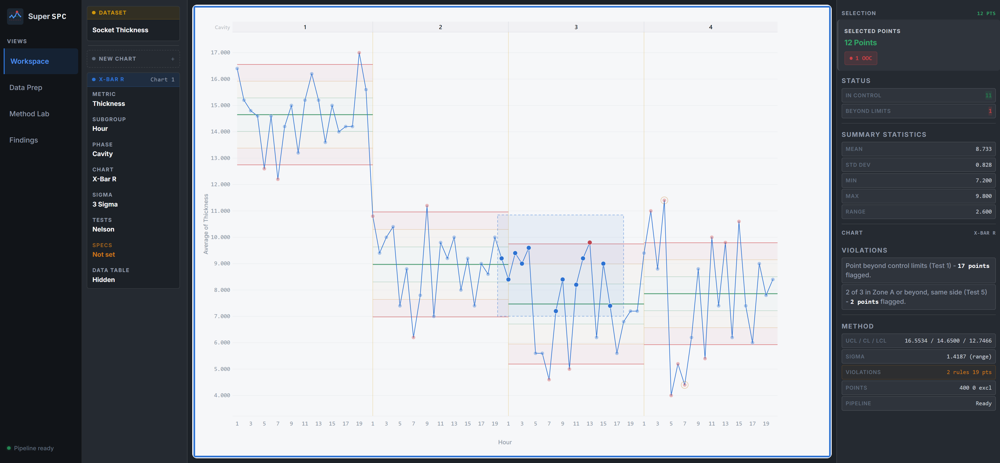

<div align="center">


# Super SPC

[English](README.md)

### 一个完全开源的现代 statistical process control 平台

<p>
  
  
  
  
  
</p>

[快速开始](#快速开始) &bull; [功能特性](#功能特性) &bull; [图表类型](#图表类型) &bull; [为什么要做这个项目](#为什么要做这个项目) &bull; [架构](#架构)

---



</div>

## 为什么要做这个项目

今天的 SPC 软件，仍然普遍存在价格高、生态封闭、难以扩展的问题。像 **JMP**、**Minitab** 这样的产品在 **Six Sigma** 和质量工程领域依然重要，但它们通常不容易针对新工作流做定制，交互方式仍然高度依赖 wizard，而且对于很多日常 SPC 场景来说成本过高。

现在，这种取舍没有以前那么必要了。借助现代 frontend tooling、实用的 Python analysis stack，以及 AI-assisted coding，小团队也能够更快地做出严肃、可用的工程软件。

**Super SPC** 就是这么诞生的：一个开源的 SPC 平台，提供更强的交互式 chart、evidence-first workflow，以及真正可自托管、可扩展、可持续演进的架构。

## 功能特性

### Interactive Charts

- 尽可能强化 chart 的交互能力：支持 `marquee selection`、axis `pan/zoom`、phase 区域选择
- 右侧提供丰富的 evidence rail，用于展示选中点详情和 method context
- 支持可配置的 forecast 区域，直接在图中预测 series 走势（进行中）


### Multi-Chart Workspace

- 支持多图并列展示
- 支持拖拽重排
- 支持自适应缩放


<table>
<tr>
<td width="50%">

**24 种 chart types**，覆盖常见 SPC 场景：
- Shewhart variables 和 attributes
- CUSUM（`tabular` + `V-mask`）
- 带 residuals 和 forecast 的 EWMA
- Hotelling `T²` 和 `MEWMA`
- `short-run`、`rare event`、`Laney P'` / `Laney U'`
- 带 `runs test` 的 `run chart`

</td>
<td width="50%">

**Multi-chart workspace** 支持拖拽式布局：
- chart 之间相互独立，不强制配对
- 每个 chart 都有自己的 accent color，按 8 色循环
- adaptive layout 会根据 pane 大小调整 padding 和字级
- 在更紧凑的布局下仍尽量保留可用 plot area
- 支持直接拖拽 axis 进行 `pan` / `scale`，交互方式接近 JMP

</td>
</tr>
</table>

### Data Prep

客户端 data engine 基于 [Arquero](https://uwdata.github.io/arquero/)。

| Phase 1 (Row Ops) | Phase 2 (Column Ops) | Phase 3 (Validation) |
|---|---|---|
| Filter (11 operators) | Rename | Range validation |
| Find & Replace (regex) | Change type | Allowed values |
| Remove duplicates | Calculated columns | Regex patterns |
| Missing values (7 strategies) | Recode values | Column profiling |
| Trim & clean | Bin / Split / Concat | Normality assessment |
| Sort (multi-column) |  | Outlier detection |
| Column reorder & hide |  |  |

列头会直接展示 **inline histogram**、**completeness bar** 和 **summary stats**。点击任意列，可以查看更完整的 statistical profile，包括 `quantiles`、`moments`、`outlier counts` 和 `normality assessment`。


### Findings

深入每个 chart 的 control-state 信息，并输出结构化 insights。


### Method Comparison

比较不同 chart method 之间的检测行为差异。


### Keyboard-First Workflow

| Key | Action |
|---|---|
| `←` `→` | 在数据点之间导航 |
| `n` / `p` | 跳转到下一个 / 上一个 violation |
| `?` | 显示快捷键 |
| `R` `T` `C` `F` `D` `Z` | Data prep 操作 |

## 图表类型

### Shewhart Variables (10)
`XBar-R` &bull; `XBar-S` &bull; `IMR` &bull; `R` &bull; `S` &bull; `MR` &bull; `Run Chart` &bull; `Levey-Jennings` &bull; `Presummarize` &bull; `Three-Way`

### Shewhart Attributes (6)
`P` &bull; `NP` &bull; `C` &bull; `U` &bull; `Laney P'` &bull; `Laney U'`

### Short Run (4)
`Difference` &bull; `Z` &bull; `MR` &bull; `XBar variants`

### Rare Event (2)
`G chart` &bull; `T chart`

### Advanced Platforms (5)
`CUSUM Tabular` &bull; `CUSUM V-Mask` &bull; `EWMA` &bull; `Hotelling T²` &bull; `MEWMA`

**总计 27 种 chart types**，全部支持 `zone shading`、`Nelson rules`、`Westgard rules` 和 `per-phase` limit support。

## 架构

```text
Frontend (Vite)
- Vanilla JS + D3.js + morphdom
- Arquero（client-side data transforms）
- PapaParse（CSV parsing）

REST API

Backend (FastAPI)
- SQLite (WAL mode)
- async SQLAlchemy

Python imports

algo/ (Pure Python)
- 24 chart types + 8 Nelson rules
- 6 Westgard rules + 7 sigma methods
- CUSUM ARL profiler + capability
- numpy + scipy + attrs
- pytest + hypothesis
```

## 快速开始

### 前置要求

- **Node.js** 18+
- **Python** 3.10+
- 一份包含 process data 的 CSV 文件

### Quick Start

```bash
# Clone repository
git clone https://github.com/dongyibing4real/super-spc.git
cd super-spc

# 安装 frontend dependencies
npm install

# 安装 backend dependencies
cd api
pip install -r requirements.txt
cd ..

# 启动 backend
cd api
uvicorn main:app --reload --port 8000

# 打开第二个终端，启动 frontend
npm run dev -- --port 4173
```

打开 **http://localhost:4173** 即可启动应用。

项目采用 `Vite + FastAPI` 架构，对小型或中型团队都比较容易扩展。

## Contributing

欢迎贡献代码。提交 UI 相关变更前，建议先阅读 `.claude/design/` 下的 design system 文档。

```bash
# 运行 algo test suite
cd algo
pytest -x --tb=short

# 运行 property-based tests
pytest --hypothesis-show-statistics
```

## License

本项目采用 **AGPL-3.0** 许可证，详见 [LICENSE](LICENSE)。

---

<div align="center">

[报告 Bug](https://github.com/dongyibing4real/super-spc/issues)

</div>
